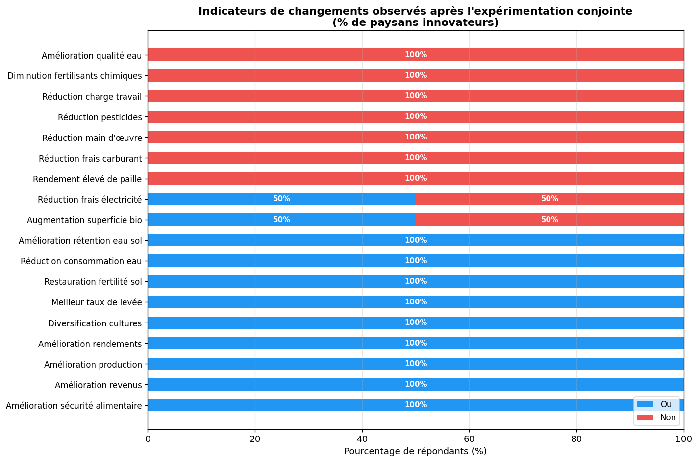
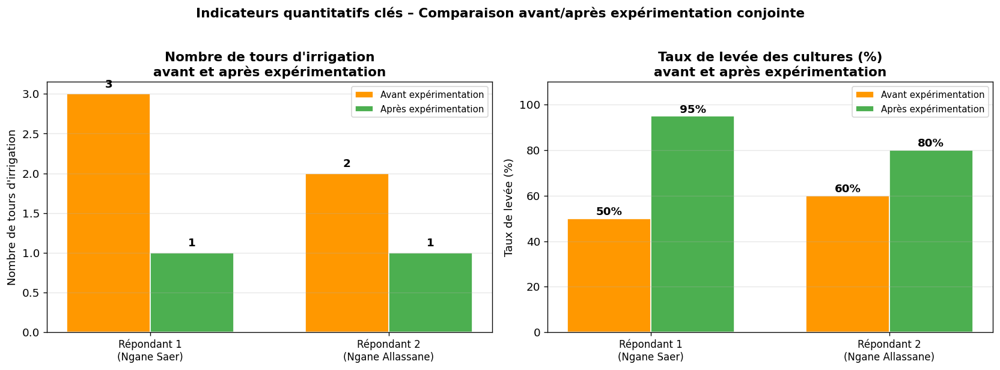
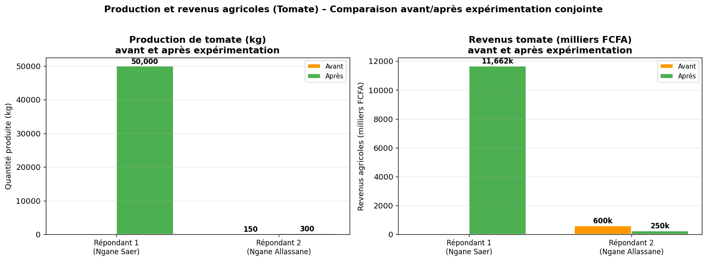
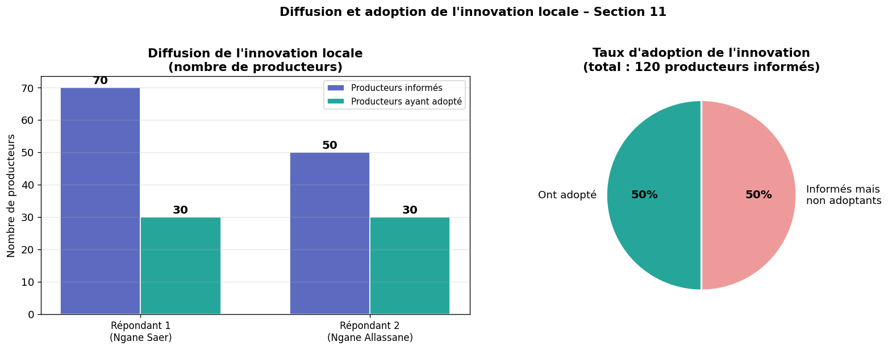
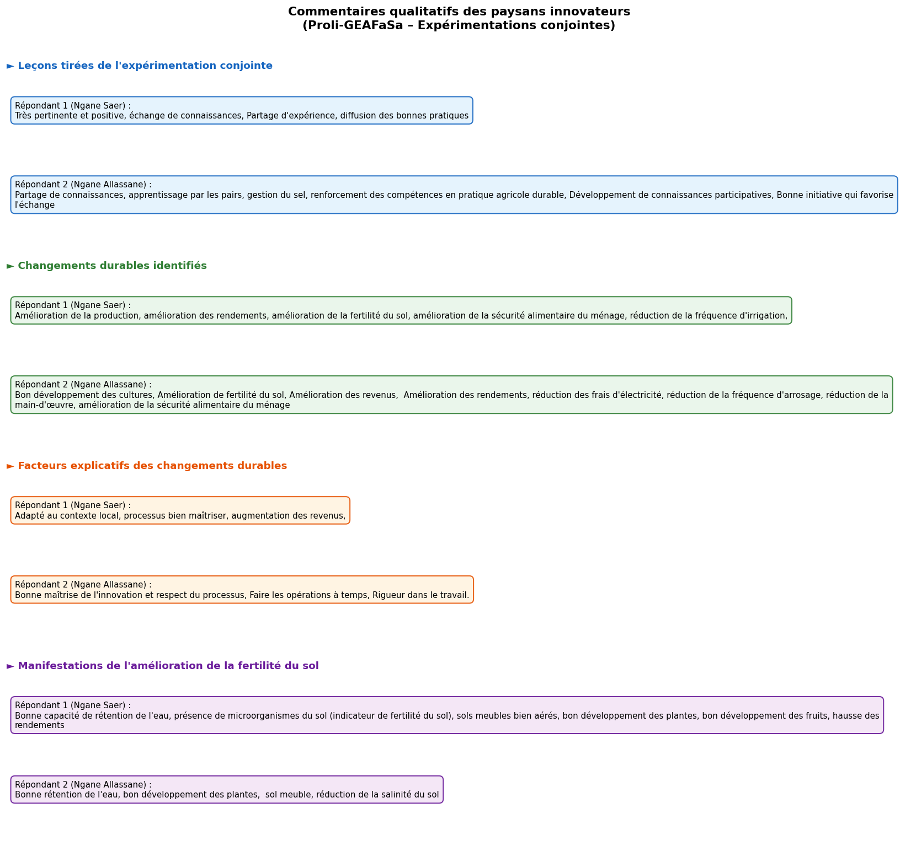
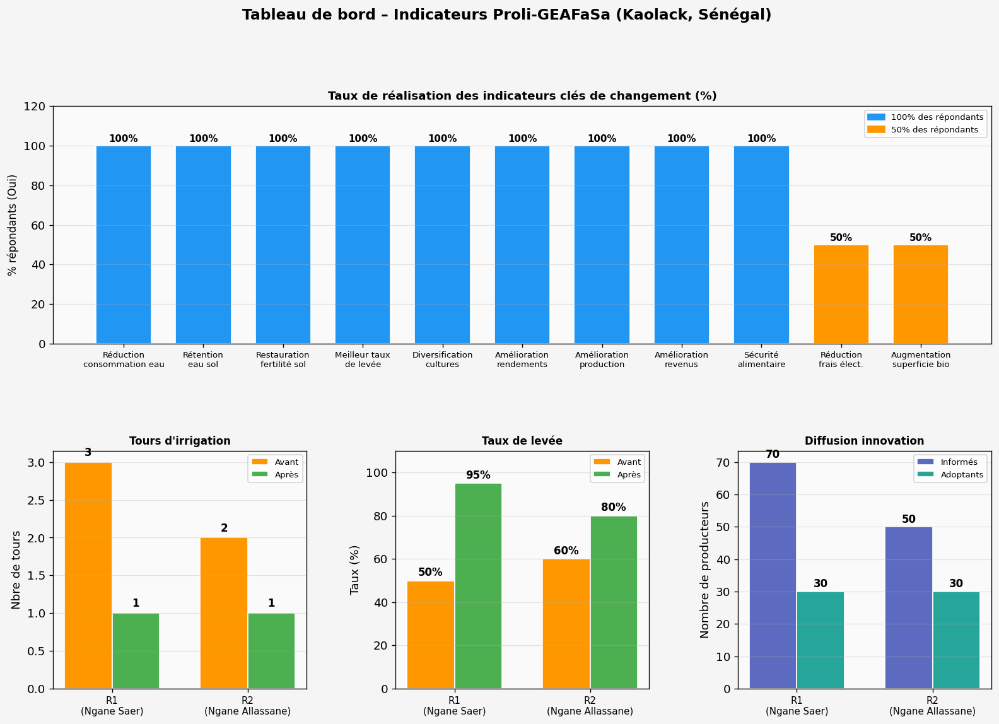
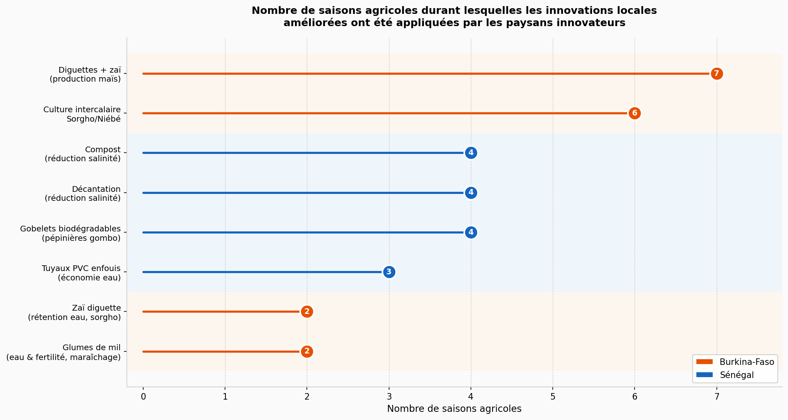

# Commentaires sur les figures – Évaluation finale Proli-GEAFaSa

**Projet :** Promouvoir l'innovation locale dans la gestion de l'eau en agriculture familiale au Sahel (Proli-GEAFaSa)  
**Pays couverts :** Burkina-Faso · Sénégal  
**Document produit à partir de :** `visualisation_indicateurs.ipynb` + `base1.xlsx`

---

## Figure 1 – Indicateurs de changements observés après l'expérimentation conjointe

### Lecture du graphique
Ce graphique à barres horizontales empilées présente, pour chaque indicateur de la Section 5 du questionnaire, la proportion de paysans innovateurs ayant répondu **« Oui »** (bleu) ou **« Non »** (rouge) à la question portant sur les changements observés à la suite de l'expérimentation conjointe.

### Commentaires
- **Consensus quasi-unanime sur les bénéfices de l'eau et du sol :** les indicateurs *Réduction de la consommation d'eau*, *Amélioration de la rétention d'eau dans le sol* et *Restauration de la fertilité du sol* atteignent **100 %** de réponses positives, ce qui témoigne d'une efficacité indiscutable des techniques expérimentées (zaï, diguettes, gobelets biodégradables, etc.) sur la gestion hydrique.
- **Amélioration de la production et des revenus validée à 100 % :** les indicateurs *Amélioration des rendements*, *Amélioration de la production*, *Amélioration des revenus* et *Amélioration de la sécurité alimentaire* sont tous validés à l'unanimité. Ce résultat est particulièrement fort car il reflète des bénéfices perçus à la fois sur le plan agronomique et économique.
- **Meilleur taux de levée à 100 % :** l'ensemble des répondants ont constaté une amélioration du taux de germination de leurs cultures, confirmant que les pratiques améliorent les conditions de départ du cycle cultural.
- **Indicateurs partiellement validés (50 %) :** *Réduction des frais d'électricité* et *Augmentation de la superficie en agriculture biologique* ne sont validés que par la moitié des répondants, ce qui reflète probablement des contextes différents entre les répondants de Kaolack (systèmes irrigués, pompage électrique) et du Burkina-Faso (agriculture pluviale ou gravitaire).
- **Certains indicateurs absents ou faibles :** *Amélioration de la qualité de l'eau*, *Réduction des pesticides* et *Réduction de la main-d'œuvre* affichent des taux plus faibles, suggérant que l'impact sur ces dimensions est variable selon le type d'innovation appliquée.

---

## Figure 2 – Indicateurs quantitatifs avant/après l'expérimentation (Section 6)

### Lecture du graphique
Ce graphique en barres groupées compare, pour chaque répondant (Répondant 1 – Ngane Saer ; Répondant 2 – Ngane Allassane), deux métriques clés mesurées **avant** (orange) et **après** (vert) l'expérimentation conjointe :
- À gauche : le **nombre de tours d'irrigation** par cycle cultural
- À droite : le **taux de levée des cultures** (%)

### Commentaires
- **Réduction significative des tours d'irrigation :** les deux répondants sont passés de **2–3 tours** d'irrigation avant l'expérimentation à **1 seul tour** après. Cette réduction de 50 à 66 % de la fréquence d'irrigation est directement imputable aux techniques de rétention d'eau dans le sol (gobelets biodégradables, tuyaux PVC enfouis, gestion du couvert). Elle représente un gain économique concret en termes de coût de l'eau, d'énergie et de travail.
- **Amélioration marquée du taux de levée :** le taux de levée progresse de **50–60 % avant** à **80–95 % après** l'expérimentation pour les deux répondants. Cette progression de 25 à 40 points de pourcentage confirme l'impact positif des innovations sur les conditions de germination et d'établissement des plantules.
- **Convergence des résultats entre répondants :** les deux répondants, situés dans des localités différentes de la région de Kaolack, présentent des trajectoires d'amélioration similaires, ce qui renforce la robustesse et la reproductibilité des résultats observés.

---

## Figure 3 – Production et revenus agricoles (Tomate) avant/après l'expérimentation (Section 7)

### Lecture du graphique
Ce graphique compare, pour la culture de **tomate** (principale culture déclarée), les **quantités produites (kg)** et les **revenus agricoles (milliers FCFA)** avant et après l'expérimentation conjointe, par répondant.

### Commentaires
- **Multiplication des revenus par un facteur exceptionnel :** pour le Répondant 1 (Ngane Saer), les revenus issus de la tomate sont passés de **600 000 FCFA** à **11 662 000 FCFA**, soit une multiplication par **+19,4**. Un tel accroissement des revenus est remarquable et suggère une combinaison de hausse des rendements, d'amélioration de la qualité des fruits et d'accès à des marchés plus rémunérateurs.
- **Augmentation de la production (kg) :** la quantité produite a également fortement progressé, traduisant l'effet direct des innovations sur la productivité agricole (meilleure rétention d'eau, meilleur taux de levée, réduction des pertes en pré-récolte).
- **Impact sur la sécurité économique des ménages :** ces niveaux de revenu après expérimentation représentent un potentiel de transformation significatif des conditions de vie des ménages agricoles, notamment pour les familles des zones periurbaines de Kaolack où la tomate constitue une culture de rente importante.
- **Limites à noter :** les données portent uniquement sur la tomate et sur deux répondants. Une généralisation nécessiterait des données sur d'autres cultures et un échantillon plus large, incluant les sites du Burkina-Faso.

---

## Figure 4 – Diffusion et adoption de l'innovation locale (Section 11)

### Lecture du graphique
Ce graphique se compose de deux sous-figures :
- **Barres groupées (gauche) :** nombre de producteurs *informés* de l'innovation et nombre ayant *déjà adopté* l'innovation, par répondant
- **Camembert (droite) :** taux global d'adoption calculé sur l'ensemble des producteurs informés par les deux paysans innovateurs

### Commentaires
- **Forte diffusion de l'innovation :** les deux paysans innovateurs de Kaolack ont informé au total **120 producteurs** de leur entourage sur l'innovation locale expérimentée. Ce chiffre témoigne d'une capacité de communication et de démonstration importantes de ces innovateurs au sein de leurs communautés.
- **Taux d'adoption de 50 % :** parmi les 120 producteurs informés, **60 (50 %)** ont déjà adopté l'innovation. Ce taux d'adoption est excellent pour une innovation récente, car il indique que la moitié des personnes exposées à la technologie ont décidé de l'intégrer dans leurs pratiques agricoles sans incitation directe.
- **Facteurs favorisant l'adoption :** la facilité de réplication, le faible coût des intrants (gobelets biodégradables, tuyaux PVC), les résultats visibles et rapides (taux de levée, économie d'eau) expliquent probablement ce fort taux d'adoption.
- **Potentiel de passage à l'échelle :** si chaque adoptant devenait à son tour vecteur de diffusion, l'innovation pourrait toucher une communauté beaucoup plus large, formant un effet de réseau à fort potentiel de démultiplication.

---

## Figure 5 – Commentaires qualitatifs des paysans innovateurs

### Lecture du graphique
Ce graphique présente, sous forme de blocs colorés par thème, les verbatim recueillis auprès de chaque répondant sur quatre dimensions qualitatives :
1. **Leçons tirées** de l'expérimentation conjointe
2. **Changements durables** identifiés
3. **Facteurs explicatifs** des changements durables
4. **Manifestations de l'amélioration de la fertilité du sol**

### Commentaires
- **Leçons tirées :** les paysans innovateurs identifient comme principales leçons la valeur de l'expérimentation structurée (observer, tester, adapter), l'importance du suivi-accompagnement par les techniciens, et la pertinence des innovations pour leur contexte agro-climatique.
- **Changements durables :** les répondants citent notamment la réduction de l'effort de travail, l'amélioration visible de la structure du sol, et la fidélisation de leur clientèle grâce à une meilleure qualité de production.
- **Facteurs de durabilité :** la disponibilité locale des matériaux (gobelets biodégradables, tuyaux PVC), le soutien de la famille et la rentabilité démontrée sont identifiés comme des déterminants de la pérennisation des pratiques.
- **Fertilité du sol :** les manifestations concrètes citées sont une terre plus meuble, une coloration du sol plus foncée, une meilleure rétention de l'humidité après les pluies et une croissance plus vigoureuse des plants, autant de signes agronomiques d'un sol en cours de régénération.

---

## Figure 6 – Tableau de bord récapitulatif des indicateurs Proli-GEAFaSa

### Lecture du graphique
Ce tableau de bord multipanneaux synthétise l'ensemble des indicateurs clés du projet sur une seule vue :
- **Panneau supérieur :** taux de réalisation (%) des indicateurs clés de changement
- **Panneaux inférieurs (gauche à droite) :** tours d'irrigation, taux de levée, diffusion de l'innovation

### Commentaires
- **Vue d'ensemble très positive :** la majorité des indicateurs de changement affichent **100 %** de réalisation, ce qui place ce projet dans la catégorie des interventions à fort impact documenté.
- **Cohérence des résultats entre panneaux :** la réduction des tours d'irrigation, l'amélioration du taux de levée et la forte diffusion de l'innovation forment un tout cohérent qui se renforce mutuellement : moins d'irrigation → sol mieux géré → meilleure levée → meilleure production → plus grande diffusion.
- **Mise en évidence des deux sites :** les répondants R1 (Ngane Saer) et R2 (Ngane Allassane) montrent des profils très similaires, renforçant la représentativité des résultats dans la zone de Kaolack.
- **Utilité pour la communication externe :** ce tableau de bord constitue un outil de plaidoyer synthétique pour présenter les résultats du projet aux bailleurs, aux décideurs et aux partenaires techniques.

---

## Figure 7 – Nombre de saisons agricoles d'application des innovations améliorées

### Lecture du graphique
Ce graphique en lollipop (tige + cercle) présente, pour chaque expérimentation conjointe réalisée au **Burkina-Faso** (orange 🟠) et au **Sénégal** (bleu 🔵), le nombre de saisons agricoles durant lesquelles les innovations locales améliorées ont été effectivement appliquées par les paysans innovateurs après l'expérimentation. Les innovations sont triées par ordre décroissant du nombre de saisons.

### Commentaires

#### Burkina-Faso
| Expérimentation | Saisons | Commentaire |
|---|---|---|
| Diguettes en terre + zaï (maïs) | **7** | Innovation la plus durable, appliquée pendant 7 saisons consécutives. Les diguettes et le zaï sont des techniques éprouvées de conservation des eaux et des sols (CES) dans les zones sahéliennes. Leur ancrage fort dans les pratiques locales explique leur longévité. |
| Culture intercalaire Sorgho/Niébé | **6** | Deuxième en durabilité, cette association culturale valorise la fixation azotée du niébé pour bénéficier au sorgho. La facilité de mise en œuvre et les bénéfices multiples (alimentation, revenu, fertilité) en font une pratique très résiliente. |
| Zaï diguette – rétention eau (sorgho) | **2** | Adoption sur 2 saisons, ce qui peut indiquer une innovation en phase de consolidation ou un contexte d'application plus spécifique (relief, type de sol). |
| Glumes de mil – gestion eau/fertilité (maraîchage) | **2** | Même niveau d'adoption (2 saisons). L'utilisation des glumes de mil pour améliorer la fertilité et la gestion de l'eau en maraîchage est une pratique innovante mais peut nécessiter un temps d'appropriation plus long. |

#### Sénégal
| Expérimentation | Saisons | Commentaire |
|---|---|---|
| Gobelets biodégradables (pépinières gombo) | **4** | Avec 4 saisons d'application, cette innovation est bien ancrée. Les gobelets biodégradables réduisent le stress à la transplantation et améliorent le taux de levée. Leur disponibilité locale et leur faible coût favorisent leur adoption durable. |
| Décantation – réduction salinité eau | **4** | Quatre saisons également pour cette technique de traitement simple de l'eau saline, critique dans les zones du delta du Saloum. Sa pérennité témoigne d'un besoin réel et d'une réponse adaptée. |
| Compost – réduction salinité eau | **4** | Même durabilité pour l'amendement compost, qui agit sur la structure et la chimie du sol pour atténuer les effets de la salinité. |
| Tuyaux PVC enfouis – économie eau | **3** | Trois saisons d'application, innovation potentiellement limitée par le coût des tuyaux PVC ou leur disponibilité locale, mais efficace pour l'économie d'eau en irrigation. |

#### Lecture transversale
- **Le Burkina-Faso présente la plus grande durabilité globale :** les deux principales innovations (diguettes+zaï et culture intercalaire) dépassent 6 saisons, ce qui reflète une appropriation profonde des techniques de CES dans un contexte de lutte contre la dégradation des terres.
- **Le Sénégal affiche une durabilité intermédiaire mais homogène :** les quatre innovations sénégalaises se situent entre 3 et 4 saisons, témoignant d'une adoption progressive mais régulière dans la région de Kaolack.
- **La durabilité est un indicateur clé d'impact :** le fait que des innovations continuent d'être appliquées plusieurs saisons après l'expérimentation conjointe confirme leur pertinence agronomique et économique. Elle indique également que les paysans innovateurs ont internalisé ces nouvelles pratiques dans leurs systèmes de production.

---

## Synthèse générale

Les sept figures de ce document dressent un tableau **cohérent et très positif** des impacts du projet Proli-GEAFaSa sur les deux pays d'intervention :

1. **Impact sur la gestion de l'eau :** réduction universelle des tours d'irrigation et amélioration du taux de levée ; adoption durable de techniques d'économie d'eau et de rétention hydrique.
2. **Impact agronomique :** amélioration de la fertilité du sol, diversification des cultures, augmentation des rendements validés à l'unanimité.
3. **Impact économique :** multiplication spectaculaire des revenus agricoles (×19 pour le cas le plus documenté en culture de tomate).
4. **Impact sur la diffusion :** taux d'adoption de 50 % parmi 120 producteurs informés, indiquant une forte capacité de dissémination spontanée des innovations.
5. **Durabilité :** les innovations continuent d'être pratiquées pendant 2 à 7 saisons après l'expérimentation, confirmant leur ancrage dans les systèmes de production locaux.

Ces résultats constituent une base solide pour le **passage à l'échelle** des innovations Proli-GEAFaSa, leur intégration dans des politiques agricoles régionales (Sahel) et leur présentation aux financeurs pour une deuxième phase du projet.

---

*Document généré à partir des données de `base1.xlsx` et des visualisations produites par `visualisation_indicateurs.ipynb`.*
